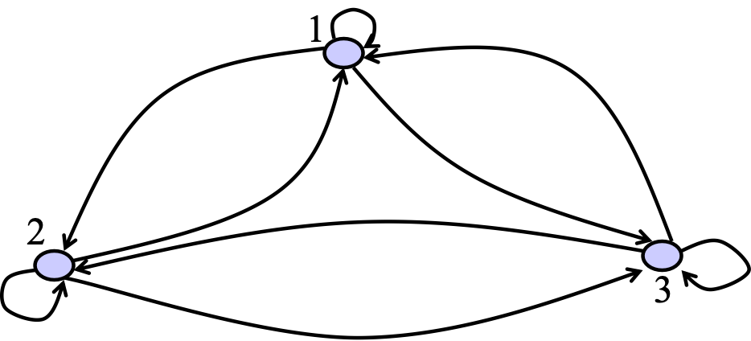

## 第1章 概论

### 1.1 制造业的发展历程

#### 大、小制造的概念

“小制造”（manufacturing）指传统的机械制造，重点是加工（fabrication）和装配（assembly）；

“大制造”（生产，production）指产品生命周期中，从供应市场到需求市场整个供应链中的所有活动。

#### 制造业在我国国民经济中的地位

- 制造业将长期存在
- 制造业仍是我国经济的中坚力量
- 我国制造业还在进一步发展之中

#### 制造业的发展历程

- 技术角度4个阶段：
	- 第一次工业革命，18 世纪末，随着蒸汽驱动的机械制造设备的出现。1784年：第一架纺织机。
	- 第二次工业革命，20 世纪初，随着基于劳动分工的、电力驱动的大规模生产的出现。1870 年：第一条生产线美国辛辛那提屠宰场
	- 第三次工业革命，20 世纪 70 年代，用电子和 IT 技术实现制造流程的进一步自动化。1969 年：第一个可编程逻辑控制器（PLC）
	- 第四次工业革命，现在，基于信息物理融合系统
- 管理和市场角度3个阶段：
	- 单件（定制）生产时代：生产规模小，速度慢，产品缺少统一的标准。特点：客户定制需求，付定金，等候生产。
	- 大批量（大规模）生产时代：生产规模急速增加；许多产品在接到用户订单之前，厂家就预先大批量生产，再由经销商零售给客户。重要标志：标准化技术（为在一定的范围内获得最佳秩序，对实际的或潜在的问题制定共同的和重复使用的规则的活动，称为标准化）、流水线技术、逐渐成熟。
	- 个性化（大规模定制）生产时代

### 1.2 现代制造业的特点

#### 现代制造的特点（6个）、对应关系及典型案例

（1）高效化
——产品的需求量依然很大
——实现手段：自动化

（2）柔性化
——个性化需求越来越明显
——实现手段：智能化

（3）集成化
——产品越来越复杂
——实现手段：信息化

### 1.3 计算机集成制造系统的基本概念

#### CIM和CIMS的概念

- CIM：Computer Integrated Manufacturing的缩写，译为“计算机集成制造”。
	- 企业各个生产环节是一个不可分隔的整体（集成）；
	- 企业生产制造过程实质上是对数据的采集、传递和加工处理的过程（信息）
	- CIM是一种组织、管理与运行企业生产的新哲理，它借助计算机软硬件，综合运用现代管理技术、制造技术、信息技术、自动化技术、系统工程技术，将企业生产全部过程中有关人、技术、经营管理三要素及其信息流与物流有机地集成并优化运行，以实现产品高质、低耗、上市快，从而使企业赢得市场竞争。
	- CIM是一种思想、模式、哲理，强调企业信息集成
- CIMS：CIM System 的缩写，译为“计算机集成制造系统“。

#### CIMS的组成

- 三要素：人/机构、经营、技术
- 四部分：
	- （1）经营管理子系统（例如ERP，课程第4章介绍）；
	- （2）工程分析/设计子系统（例如PDM、CAPP，课程第3章介绍）；
	- （3）制造子系统（例如CNC、AGV，课程第5章介绍）；
	- （4）支持环境子系统（即数据管理/信息与通信子系统）；

## 第2章 CIMS的体系结构

### 1 单元级制造系统

#### 单元级制造系统的分类

- 工作中心：按设备的功能分组，同一零件需要多个工作中心加工，运输路线较长。
- 制造单元：按零件的工艺需求分组，同一零件只需一个制造单元加工，运输路线短，但容易造成设备空闲。

当前研究认为单元级制造系统首先注重效率，而在车间级制造系统再考虑柔性，所以将传统的工作中心改造构造制造单元成为研究热点。

### 2 车间级制造系统

#### 车间的类型及各自特点和代表性行业（4种）

- 流水车间（flow-shop），产品种类较单一，不同产品的工艺路线相同或类似；
	- 大连冷冻机厂成套事业部两器工段、汽车装配车间
- 作业车间或机组车间（job-shop），产品种类较多，工艺路线复杂；
	- 重型水电零件加工车间，零件通过吊车、叉车在各个机床间移动，移动路线通常很复杂
- 装配作业车间（assembly job-shop），存在装配关系的作业车间；
	- 制冷机装配车间，产品不动，人员带着装配设备移动
- 可重入作业车间（re-entrant job-shop），具有工件多次进入同一组流水线的特点。
	- 液晶面板生产线，以半导体产品的生产为主，具有大批量与单件生产的特点

### 3 企业级制造系统

#### 制造企业按产品的分类（3类）及代表性行业

- 连续型生产：石油、化工、冶金 
- 离散型生产：机械、电子、轻工
- 混合型生产：食品、造纸

#### 离散型制造企业按生产方式的分类（5类）及代表性行业

从偏连续型生产到偏离散型生产排序，得到：
- 按库存生产（make-to-stock，MTS）
	- 存在成品库存，即无订单时也要提前生产储备；产品生产周期较短，产品种类较单一。如家用电器。
- 按订单装配（assemble-to-order，ATO）
	- 零件或部件按库存生产，成品接到订单后再装配；产品生产周期居中，产品整体上相似，但局部存在细小差异的型号较多。如家用汽车、个人计算机。
- 按订单生产（make-to-order，MTO）
	- 接到订单后再开始生产，仅可能存在一定的原材料库存；产品生产周期较长，产品种类较多。如中型机械、服装（批量大）等。
- 按订单设计（design-to-order，DTO 或engineer-to-order，ETO）
	- 接到订单后开始设计，设计结束后才开始生产；产品生产周期长，产品种类繁多，并且新产品很多。如大型机械产品（重工、起重、飞机、船舶）、模具、建筑等。
- 按订单研制（research-to-order，RTO）
	- 与按订单设计类似，区别在于设计产品所需的时间通常可估计，而研制产品存在失败的可能，需要反复实验，所需的时间不好估计。如高新技术行业（电子芯片研发、生物制药、专业软件开发等）。

## 第3章 CAD/CAM集成技术

### 1 计算机辅助设计技术

#### CAD技术的含义和发展历程（6个时间点）

计算机辅助设计（computer aided design, CAD），是指在产品开发过程中使用计算机系统辅助产品创建、修改、分析和优化的有关技术。狭义上的CAD特指利用相关的计算机软件实现产品的二维和三维图纸设计，广义上的CAD还包括了有限元分析、优化设计和反求工程等内容。

- 20世纪60年代初，CAD产生
- 20世纪70年代中期，出现了线框模型
- 20世纪70年代后期，出现了自由曲面建模技术（表面模型）
- 20世纪80年代初，出现了实体造型技术、支持建立物理引擎
- 20世纪80年代中期，出现参数化设计技术
- 20世纪90年代初期，出现变量化实体造型技术

#### CAD 每个时间点出现的新技术（4次革命）

- 第一次CAD技术革命：自由曲面建模技术
- 第二次CAD技术革命：实体造型技术
- 第三次CAD技术革命：参数化设计技术
- 第四次CAD技术革命：变量化实体造型技术

#### CAD技术的未来发展方向（3点）

- （1）更加精确化和高效化，
- （2）更加集成化，
- （3）更加智能化，

#### CAD相关的主要计算机图形技术（4点）

- 图形变换技术：构造或修改图形
- 图形消隐技术：消除二义性
- 图形的光照处理技术：创造真实感图形
- 图形裁剪技术：显示指定的部分画面

#### CAD造型时常用的曲线（2个）

- Bezier曲线：参数多项式曲线
- B 样条曲线：Bezier曲线的基础上进行改进，优点为局部可修改性

#### 常用的曲面造型方法（3种）

- 扫描曲面：由曲线的运动轨迹生成曲面
- 直纹面：以两条空间曲线为相对边界定义出的曲面
- 复杂曲面：对给定离散点进行拟合或逼近形成的曲面

#### 常用的三维几何造型技术（4种）

- 构造实体几何法（constructive solid geometry，CSG）
- 边界表示法（boundary representation，B-rep）
- 分割表示法（decomposition representation，D-rep）
- 扫描表示法（sweep）

#### CSG与B-rep的优缺点

|     | B-rep                                                                                                   | CSG                                                                                                                                |
| --- | ------------------------------------------------------------------------------------------------------- | ---------------------------------------------------------------------------------------------------------------------------------- |
| 优点  | 有较多的关于面、边、点及其相互关系的信息。有利于生成和绘制线框图、投影图，有利于计算几何特性，易于同二维绘图软件衔接和同曲面建模软件相关联。                                  | 方法简洁，生成速度快，处理方便，无冗余信息，而且能够详细地记录构成实体的原始特征参数，甚至在必要时可修改体素参数或附加体素进行重新拼合。数据结构比较简单，数据量较小，修改比较容易，而且可以方便地转换成边界（Brep）表示。                    |
| 缺点  | 由于它的核心信息是面，因而对几何物体的整体描述能力相对较差，无法提供关于实体生成过程的信息，也无法记录组成几何体的基本体素的元素的原始数据，同时描述物体所需信息量较多，边界表达法的表达形式不唯一    | 由于信息简单，这种数据结构无法存贮物体最终的详细信息，例如边界、顶点的信息等。由于CSG表示受体素的种类和对体素操作的种类的限制，使得它表示形体的覆盖域有较大的局限性，而且对形体的局部操作（例如，倒角等等）不易实现，显示CSG表示的结果形体时需要的间也比较长。 |

#### 装配模型需要包含的信息和提供的功能

- 所需信息：层次关系、装配关系、装配约束
- 提供功能：装配干涉分析、质量特性分析、爆炸视图

### 2 计算机辅助制造技术

#### CAM技术的含义和发展历程（4个时间点）

计算机辅助制造（computer aided manufacturing, CAM）技术是将计算机系统直接或间接地应用于计划、管理和控制生产作业的有关技术。

- 20世纪50年代初：最初的CAM系统产生，直接计算数控刀路
- 20世纪70年代末：CAD与CAM一体化，图形交互数控编程
- 20世纪80年代：致力于实现计算机集成制造（CIM）和柔性制造（FM）
	- 计算机辅助工艺规划（computer aided process planning, CAPP）
	- 零件分类编码系统（classing and coding system）
	- 计算机辅助质量管理（computer aided quality，CAQ）
- 20世纪90年代：标准化、集成化、智能化发展
	- 出现产品数据管理（product data management, PDM）
	- 面向对象（object oriented, OO）
	- 并行工程（concurrent engineering，CE）
	- 人工智能（artificial intelligence，AI）

#### CAM技术的未来发展方向（3点）

标准化、集成化、智能化

#### CAPP的分类（5种）

根据工艺决策的方式分类：
- 检索式：仅单纯地存储历史产品的工艺信息，工艺人员设计新工艺时，检索出类似的工艺参考，再人为地修改，编制新工艺。
- 派生式（主流方式）：利用零件的分类编码技术，将相似零件归并成零件族，设计时检索出零件族的标准工艺流程，然后根据设计对象的具体特征加以修订
- 创成式：将人们设计工艺过程时的推理和决策方法转换成计算机可以理解的决策逻辑、算法，在使用时由计算机程序根据内容的决策逻辑、算法以及生产环节信息，自动生成零件的工艺流程
- 混合式：创成式CAPP掺杂派生式方法
- 专家系统：应用了人工智能技术中的专家系统的CAPP

#### 目前主要的产品数据交换标准

- IGES：初始图形交换规范（initial graphics exchange specification，IGES），是当时世界上最著名的标准，许多著名的的计算机软/硬件厂商都声称在其产品中支持该标准
- STEP：产品模型数据交换标准（Standard for the Exchange of Product Model Data），国际标准，是一个适用于CAD数据格式以及其它相关领域、开放扩展的标准

#### STEP体系结构上的层次（3层）

- 应用层：
	- 包括应用协议及对应的抽象测试集，这是面向具体应用的一个层次；
	- 这个层次负责解释不同应用软件提供的数据格式
- 逻辑层：
	- 包括集成通用资源及集成应用资源，以及由这些资源建造的一个完整的产品模型；
	- 它把产品数据从实际应用中抽象出来，并与具体实现无关。
- 物理层：
	- 包括实现方法，给出具体在计算机上的实现形式。
	- 这个层次负责解释数据在不同计算机或操作系统上的存储格式。
	
#### 协同设计的组成部分（3个）

- <1>流程模块，与项目管理软件类似，提供设计工作的流程管理。
- <2>协作模块，制定公共资源的提取、提交和提取机制，为不同设计人员提供交流环境。
- <3>管理模块，提供产品图纸、文档等各种设计资源的管理功能，与PDM软件类似。

#### 加工元、工步、工序和工艺的层次关系

工艺决策的过程通常先将产品特征转换成最基本的加工动作，称为加工元

### 3 计算机辅助工程技术

#### 有限元分析的整体思想

化整为零、积零为整。

#### 有限元分析的主要步骤（6步）

- 问题及求解域定义
- 求解域离散化：根据一定方法划分单元格，可适当忽略细节，如，选择三节点三角形平面作为应力单元
- 确定状态变量及控制方法：根据简单的弹性变形公式，查找零件材质的相关系数，计算出局部单元的变形
- 单元推导：从直接受力或施加约束的单元，逐步计算相邻单元受力和位移情况
- 总装求解：由局部单元的位移量计算零件总体位移量
- 联立方程组求解：最后显示分析结果，通常采用应力分析图或位移分析图等形式

### 4 其它现代设计方法

#### 现代设计方法的主要组成

创新设计、有限元分析、优化设计和可靠性设计。

可靠性的定义是产品在规定的条件下和在规定的时间内完成规定功能的能力。通过概率函数模拟产品的质量相关信息，从而可以更准确的描述并且能够更细致地优化这些设计信息。

#### 其它现代设计方法及主要目的

- 动态设计：在动态作用下，以结构构件动力状态反应为依据的设计
- 模块化设计：提高了设计效率，并降低设计成本；支持大规模定制、可重构制造系统
- 绿色设计：在产品整个生命周期内，着重考虑产品环境属性（可拆卸性，可回收性、可维护性、可重复利用性等）并将其作为设计目标，在满足环境目标要求的同时，保证产品应有的功能、使用寿命、质量等要求
- 人因工程：研究人和机器、环境的相互作用及其合理结合，使设计的机器和环境系统适合人的生理、心理等特点，达到在生产中提高效率、安全、健康和舒适目的的一门科学
- 反求工程：用一定的测量手段对实物或模型进行测量，根据测量数据从样品生成产品数字化信息模型，并在此基础上进行产品设计、开发及生产的全过程
- TRIZ理论：“发明家式的解决任务理论”
	- 8大技术系统进化法则；
	- IFR最终理想解；
	- 40个发明原理；
	- 39个通用参数和阿奇舒勒矛盾矩阵；
	- 物理矛盾和分离原理；
	- 物-场模型分析；
	- 76个标准解法；
	- ARIZ发明问题解决算法；
	- 科学原理知识库。

## 第4章 CIMS环境下的生产经营

### 4.1 概述

#### 系统分析和系统综合的所指内容

- 系统分析的目的是了解系统的运行原理，以便能够对新的系统设计方案的执行效果进行预测，是系统设计的基础。其主要工作为制造系统的建模与性能评价。
- 系统综合的目的就是根据系统分析掌握的原理，构造出新的更优秀的制造系统，或对现有系统进行优化。其主要工作为制造系统的设计与控制。

#### 过程建模和企业建模的含义

- 企业建模：包括生产层和管理层的建模
- 过程建模：仅包括制造企业中最核心的主要产品的全部或部分生产流程的建模

#### 当前阶段过程建模和企业建模的主要用途

- 制造企业建模仅能实现初级建模用途（描述建模对象，方便人们分析、理解和学习建模对象的运行原理），主要为开发制造企业的管理信息系统（例如ERP）提供设计大纲，属于信息学科的研究范畴
- 制造过程建模由于研究对象涉及范围较窄，因而能够研究得更加深入，能够通过模型为新的生产线设计方案提供评测，实现前述的高级建模用途（模拟建模对象的运行过程，通过模型测试新的设计方案是否可行，支持综合），即优化建模对象。

#### 分析类和仿真类模型的内容和区别

- 分析类模型主要通过数学公式描述制造过程，并且能够利用数学方法简化制造过程的描述，从而能够快速优化设计或控制方案。
	- 优点是计算快，理论价值高
	- 缺点是适用范围有限，精度较差。
- 仿真类模型主要通过程序（辅以图形）细致模拟制造过程中的每个步骤，获得制造过程性能的仿真结果，支持解决优化设计或控制问题。
	- 优点是适用范围广，精度较高
	- 缺点是计算耗时长，通常被认为是技术研究。

#### 设计、计划和调度所指的时间范围

- 设计问题：长期（几月或几年）综合问题，即包括从无到有产生符合要求的新系统，也包括在现有系统基础上，通过系统校正、系统重构等方法产生比原系统性能更优良的新系统。
- 控制问题：中短期综合问题，随着实际生产情况的变化随时调整
	- 生产计划：中期控制问题
	- 生产调度：短期控制问题

### 4.2 制造企业建模

#### 代表性的企业建模体系（4种）

- 美国制造工程师协会（SME）的轮式结构
- CIM-OSA体系结构
- IDEF体系结构：IDEF（集成计算器辅助制造，Integrated Computer－Aided Manufacturing Definition）
- TOGAF体系结构框架：开放组体系结构框架（The Open Group Architecture Framework，TOGAF）

#### CIM-OSA中的3个层次、3个阶段和4种视图

- 3  个层次：
	- 通用层：CIM－OSA基本结构构成成份（通用结构模块）的一种参考目录，包括元件、约束、规则、术语、服务和协议等，该层所描述的结构成份广泛应用于CIMS中
	- 部分通用层：包含一组适用于多类特殊制造企业的部分通用模型。部分通用模型包括按照工业类型、企业规模、国别等不同分类的各类典型结构
	- 专用层：仅适用于一个特定企业，一个企业CIMS只能通过一种专用结构来描述，该结构包含了企业所必需的所有知识，可以直接用来描述企业物理元件和信息技术的集成元件
- 3 个阶段：
	- 需求定义建模层：描述一个企业做什么和怎样做的建模层次，这是用户企业需求的定义阶段，是及其重要的一个阶段，用来为设计说明层和实施描述层的系统设计和实施提供选择方案。
	- 设计说明建模层：构造和优化由用户根据全局经营和系统约束来定义的经营需求，属于系统组织和设计的范畴。
	- 实施描述建模层：阐明了有效地实现企业运行的一套必须的组成元件，属于决策和系统实施的范畴。
- 4 种视图
	- 组织视图：企业的组织结构，即功能和控制结构的职责，信息与资源的职责。
	- 功能视图：满足企业目标的功能结构和相关的控制结构。控制结构定义了控制顺序的规则或企业内部的活动流以及基本经营过程的规则。
	- 资源视图：资源、资源与功能和控制结构的关系以及资源和组织的关系。
	- 信息视图：每个功能所需的信息。

#### IDEF0、IDEF3和IDEF1X分别是哪种模型

IDEF0（功能模型）、IDEF3（过程模型）、IDEF1X（信息模型）

#### IDEF0方法中4种信息的位置

四个箭头、四类信息、位置固定。

左入输入，上入控制，下入机制，右出输出。

#### 企业建模体系的共同特点（3点）

- 普遍存在多个视图：用以从多个角度描述企业
- 支持信息系统开发的各个环节
- 支持企业模型到程序代码的转换

#### MRP、MRPⅡ、ERP的含义和出现顺序

- MRP（时断式MRP）：物料需求计划（Material Requirement Planning，MRP），20世纪60年代后期（数据处理时代），企业的管理者们清楚地认识到，真正的需要是有效的订单交货日期（库存或提前期管理），产生了对物料清单的管理与利用
	- BOM：物料清单（Bill of Material，BOM）
	- CLT：累计提前期（Cumulative Lead Time），完成某项活动的最长计划时间（关键路径）
- MRP（闭环MRP）：MRP在计划执行过程中，加入了来自车间、供应商和计划人员的反馈信息，并利用这些信息进行计划的平衡调整。从而围绕着物料需求计划，使生产的全过程形成了一个统一的闭环MRP系统。增加了生产能力的反馈，形成闭环生产系统。
- MRPⅡ：制造资源计划（Manufacturing Resource Planning，MRPⅡ），20世纪80年代（信息技术时代），企业的管理者们又认识到制造业要有一个集成计划，综合管理各种制造资源（市场、资金、设备、人力、工具、库房等），而不仅仅是原料。功能更全面，制定计划所考虑的因素更多，主要增加了市场预测与财务/成本分析。
- ERP：企业资源计划（Enterprise Resource Planning，ERP），20世纪90年代（网络时代），企业信息处理量不断加大，企业资源管理的复杂化也不断加大，信息的集成度要求扩大到企业的整个资源（客户关系、信息、文化等）的利用、管理，从而产生了新一代的管理理论与计算机系统。

#### 计算累计提前期

#### 国内和国外最著名的ERP厂商

- 国内：用友、金蝶；
- 国外：SAP、Oracle。

#### ERP功能的三个层次

- 电子数据处理系统（electronic data processing system，EDPS）：也称为办公自动化系统（Office Automation，OA），使用计算机部分代替手工劳动，提高基本业务的处理速度。
- 管理信息系统（management information system，MIS）：集成各种信息，进行综合处理。
- 决策支持系统（decision support system，DSS）：能够进行数据挖掘，提供人工难以直接获取的决策信息；优化计算，从海量方案中找出较优的决策方案。

### 4.3 制造过程建模

#### 马尔科夫链的重要性质

马尔科夫性质（无后效性）

#### 状态与状态空间的定义

在制造系统研究中，参数t一般表示时间，将X(t)的取值叫做系统在时间t的状态， X(t)所有取值的集合称为状态空间，记作S。

#### 转移矩阵、概率向量的定义和性质

从第 i 个状态转移到第 j 个状态的概率 $p_{ij}$ 成为转移概率，构成的 $n$ 阶方阵H，称为状态转移概率矩阵，简称为转移矩阵（或随机矩阵）。满足性质 $p_{ij} \geq 0$ 且 $\forall i, \sum_{j = 1}^{n} p_{ij} = 1$。

从长期过程来看，当前处在哪个状态也是不确定的，可以用一个 $n$ 维向量表示，称为概率向量 $P = (p_{1}, p_{2}, p_{3}, \dots)$，其中 $p_{1}, p_{2}, p_{3}, \dots$ 表示当前为状态 1、2、3、... 的状态，满足 $\sum p_{i} = 1$。

转移矩阵和概率向量的关系：
$$
P(k + 1) = P(k)H
$$

#### 使用稳态方程分析制造系统的方法

见本节例题1、例题2

#### 排队系统的基本组成部分及主要特征

- 到达过程：描述顾客的来源和顾客依何种方式到达排队系统的过程。
	- （1）顾客源可能是有限的，也可能是无限的。
	- （2）顾客是成批到达或是单个到达。
	- （3）顾客到达间隔时间可能是随机的或确定的。
	- （4）顾客到达可能是相互独立或关联的。所谓独立就是以前顾客的到达对以后顾客的到达无影响。
	- （5）输入过程可以是平稳的（stationary）或说是对时间齐次的（homogeneous in time），也可以是非平稳的。输入过程平稳的指顾客相继到达的间隔时间分布和参数（均值、方差）与时间无关；非平稳的则是与时间相关，非平稳的处理比较困难。
- 排队规则：
	- （1）先到先服务（FCFS），例如按零件到达的先后顺序进行加工，这是最常见的一种情况。
	- （2）后到先服务（LCFS），例如仓库中迭放的钢材，后迭放上去的先被领走，就属于这种情况。
	- （3）随机服务（RAND），即当服务台空闲时，不按照排队序列而随意指定某个顾客去接受服务，例如电话交换台接通呼叫电话就是一例。
	- （4）优先权服务（PR），例如加工时间短的零件先处理（SPT）、交货期近的零件先处理（EDD）等等，各种调度方法控制下的排序属于此种规则。目前各种文献给出的调度排序规则有几百种之多。
- 服务机构：
	- （1）服务机构可以是单服务器或多服务器，这种服务形式与队列规则联合后形成了多种不同队列，不同形式的排队服务机构。
	- （2）服务方式分为单个顾客服务或成批顾客服务。
	- （3）服务时间分为确定型或随机型。
	- （4）服务时间的分布可以是平稳的，也可以是非平稳的。

#### Kendall记号中各位置表达的含义

Kendall记号：`[ X / Y / Z ] :[ d / e / f ]`。

| 位置  |         含义         |
| :-: | :----------------: |
|  X  |    顾客到达时间间隔的形式     |
|  Y  |       服务时间分布       |
|  Z  |      并列的服务器数量      |
|  d  | 排队系统的最大顾客容量（默认为无限） |
|  e  |    顾客源数量（默认为无限）    |
|  f  |   排队规则（默认为FCFS）    |

X 和 Y 的取值：
- M（Markov）——服从指数分布（到达速率服从泊松分布）；
- D（Deterministic）——固定时间；
- Ek（Erlang）——k阶爱尔朗分布；
- G（General） ——一般随机分布，指分布的形式可以任意，通常只用均值和方差描述，相关计算多为近似计算。

#### 系统的性能分析方法

见本节例题1、3和4，马尔科夫链相结合应用方法见例题2。

#### 极大代数方法

极大代数（max-algebra）是极大加法代数（max-plus algebra）的简称
- “乘法” $a \otimes b = a + b$ 表示任务串联，总时间为各部分时间之和；
- “加法” $a \oplus b = max(a, b)$ 表示任务并联，总时间为各部分时间中的最大值；

#### 双代号网络图、单代号网络图、状态转移图和活动循环图的表示方法

- 双代号网络图： 以有向线段及其两端结点的编号表示活动的网络图，即活动在有向线段上。虚线表示“虚工作”，即实际中并不存在的活动。虚线只表示前后相邻活动之间的前后关系，虚线本身既不占用时间，也不耗用资源。
	- 
	- 
- 单代号网络图： 以结点表示活动，以有向线段表示活动之间的先后关系的网络图，即活动在结点上。
	- 
	- 
- 状态转移图：以结点表示状态，以有向线段表示状态之间的转移关系的一种过程建模方式，有向线段上标注状态转移的概率或速率。
	- 
- 活动循环图：以结点表示状态（这里是持续存在的状态，等同于活动），有向线段表示状态之间的关系的一种过程建模方法，其中状态分为活动态（简称活动），用矩形框表示；等待态（简称队列），用圆或椭圆表示。
	- 

#### 使用状态转移图、双代号网络图和双代号网络图辅助求解制造系统问题的方法

见本节例题1、2和3。

#### 经典Petri网的图形描述

Petri网模型的图形形式（还有语言形式）是一个有向的、只有两种结点的有向图。
- 各种状态称为库所（place），用圆圈“○”表示，
- 状态之间的转移称为变迁（transition），用方框“□”或竖线“┃”表示，
- 采用有向弧“→”连接库所和变迁。
- 状态的取值称为令牌或托肯（token），可用黑点在库所上标记，如“⊙” （有的系统可同时存在多个令牌）。

#### Petri网的主要高级形式（6种）及特点

- （1）时间Petri网（time Petri net）：变迁表示时间延迟
- （2）随机Petri网（stochastic Petri net）：变迁的时间延迟使用概率分布函数表达（例如指数分布）
- （3）有色（着色）Petri网（colored Petri net）：令牌具有多种颜色，用以表示多种属性；
- （4）层次Petri网（hierarchical Petri net）：网络具有多个层次，上层网络的局部可展开成一个子网络。
- （5）广义随机Petri网（generalized stochastic Petri net，GSPN）：假设变迁时间服从指数分布，结合排队理论，可实现网络图的等效化简，因此可以无需编程仿真即实现性能分析，属于分析类模型
- （6）扩展随机Petri网（extended stochastic Petri net，ESPN）：与广义随机Petri网类似，区别在于假设变迁时间服从一般分布（仅用均值和方差表达，而不关注具体分布形式），同样结合排队理论，实现近似的等效化简，属于分析类模型

#### 广义随机Petri网3种结构（串联、并联和选择）的等价化简方法

- 

$$
\frac{1}{\lambda} = \sum_{i = 1}^{n} \frac{1}{\lambda_{i}}
$$
- 
$$
\frac{1}{\lambda} = \sum_{i = 1}^{n} \frac{1}{\lambda_{i}} - \sum_{i = 1}^{n - 1}\sum_{j = i + 1}^{n} \frac{1}{\lambda_{i} + \lambda_{j}} + \sum_{i = 1}^{n - 2}\sum_{j = 1}^{n - 1}\sum_{k = 1}^{n} \frac{1}{\lambda_{i} + \lambda_{j} + \lambda_{k}} + \dots + (-1)^{n - 1} \frac{1}{\sum_{i}^{n} \lambda_{i}}
$$
- 
$$
\frac{1}{\lambda} = \sum_{i = 1}^{n} \frac{a_{i}}{\lambda_{i}}
$$
- 
$$
\frac{1}{\lambda} = \frac{\lambda_{2} + a\lambda_{1}}{(1 - a)\lambda_{1}\lambda_{2}}
$$

#### 广义随机 Petri 网的化简方法的综合应用

见例题1

####  绘制Petri网的注意事项

- （1）注意题目中出现几个加工时间，一般一个时间一个非瞬时变迁；既不要合并，也不要拆分。
- （2）总是库所与变迁交替。
- （3）不要忘记绘制箭头。
- （4）令牌表示系统的当前状态，数量由实际问题决定；不要多也不要少；通常可放置在系统的初始状态，或者不画出。
- （5）注意标注符号区分库所和变迁；瞬时变迁可以不标注。
- （6）各个变迁和库所都要有表格说明。

#### 单、双工作站模式及对应的Petri网画法

- 单工作站 Petri 网图示例： 
- 多工作站模式下的Petri网图示例：

#### 结合排队理论分析

见例题2和例题3。

#### 典型的仿真编程语言

- GPSS：一种面向模块的语言。分析人员能以模块网络的形式向计算机输送一个模型，这些模块按序号的次序联结成网络，每种模块代表一项基本的系统动作。模块可反复地使用，模块所表示的动作由分析人员负责解释，执行该项动作所需的时间也由分析人员规定。特别适用于交通系统和排队系统的建模，适用于需要详细研究的一个动态系统相互作用的情况。
- SIMAN：SIMAN既可按照进程交互方式仿真，又可按照事件调度方式仿真，还可将这两种方式结合起来进行工作。SIMAN建模强调系统模型和实验框架的区别。系统模型确定系统的静态和动态特性；实验框架确定使模型运行并产生特定输出数据的实验条件。给定了系统模型和实验框架之后，该语言除了可提供标准输出报告之外，还根据实验框架中规定的内容产生用户的输出文件，用户可采用交互式或批处理方式对该输出文件进行各类数据处理。

#### 4.4 制造过程优化

#### 单元制造系统的优点

- 技术角度5点：
	- 减少了零件物流时间，
	- 减少了生产准备时间，
	- 简化了辅助工作时间，
	- 提高了生产效率和零件质量，
	- 有利于提高针对需求量变化的快速反应能力
- 管理角度4点：
	- 有助于提高员工的责任感，
	- 有利于培养员工的“一专多能”，
	- 有助于提高员工的群体意识，
	- 有利于实行生产承包制，明确责任，

#### 制造单元的设计阶段（4个）

- 虚拟成组单元：为逻辑单元，不移动机床的物理位置。
- 准成组单元：为物理单元，但其中有部分设备不进行分组。一方面可能是因为这些设备可以加工多个零件族，不好进行分组。另一方面可能是因为市场需求还不明确，企业预留些可以灵活指派的设备来应对市场变化。
- 封闭成组单元：为物理单元，并且各个制造单元独立生产，制造单元之间不存在公用设备。
- 流水成组单元：为物理单元，在封闭成组的基础上进一步要求单元内零件族的工艺路线一致，形成流水生产线。

#### 模块化设计的主要内容

- 系列产品：在某个确定的应用范围内按照一定的规律划分其参数等级，用相同的方法实现相同功能的技术对象（整机、部件或零件），这些技术对象应该用尽可能相同的制造方法进行制造。
- 组合产品：是指用不同的结构块（或称积木块）通过合理的组合而实现不同功能的技术对象（整机、部件或零件）。

#### 分类编码系统在设计中的应用

- 应用：构思、编码、检索
- 结果：
	- 现有零件图完全合用；
	- 现有零件图需作局部修改后即可适用；
	- 现有零件图无法满足需要，只能另行设计。

#### 划分制造单元的两种方法

- 排序聚类算法
- 键能算法

#### P-中位模型及零件间的Hamming距离计算

设 $m$ 为机床数，$n$ 为零件数，$p$ 为零件的分组数（零件族数，也是单元数），$x_{ij}$（决策变量）表示零件 $i$ 是否属于零件族 $j$，若属于，则取值为1，否则为0；$d_{ij}$ 表示零件i与零件j之间的距离。

零件间的距离采用海明（Hamming）距离度量公式，并根据机床-零件矩阵求解（ROC和BEA方法中的矩阵）。

$$
d_{ij} = \sum_{k = 1}^{m} \delta(a_{ki}, a_{kj})
$$

P-中位模型目标函数为

$$
min \sum_{i = 1}^{n}\sum_{j = 1}^{n} d_{ij}x_{ij}
$$
#### 生产计划问题的层次划分

| 层级划分   | 计划对象   | 制定部门      | 执行部门       | 计划期间 | 计划期别    |
| ------ | ------ | --------- | ---------- | ---- | ------- |
| 主生产计划  | 产品     | 经营部门或主生产会 | 整个企业       | 1-3年 | 季度、半年或年 |
| 物料需求计划 | 能力需求计划 | 企业计划部门    | 车间         | 1-3月 | 旬、半月或月  |
| 能力需求计划 | 工序     | 车间计划部门    | 工段、工作中心或班组 | 1月   | 周或旬     |

#### APS的定义（2点）

高级生产计划与排程（advanced planning and scheduling，APS）或译作高级生产计划与排产、高级生产计划与调度，指一种应用先进技术解决复杂生产计划问题的软件系统。
- 所谓“复杂”通常指额外考虑了扩展优化目标的大规模生产计划问题；
- 所谓“先进技术”主要指智能搜索算法，也包括应用先进制造模式和生产过程模型等方面。

APS可以是企业资源计划（ERP）或制造执行系统（MES）的一部分，若单独作为一个系统，其层次通常位于两者之间，主要为企业的生产计划部门所使用。

#### 高级生产计划的求解

启发式算法、遗传算法，见本节案例1

#### P、NP、NPC 和 NPH 问题的定义

- P（polynomial）问题：又称多项式问题，指可以在多项式时间内被判定的问题
- NP（non-deterministic polynomial）问题：又称非确定多项式问题，指很难找到多项式时间的算法求解（或许根本不存在），但如果给出该问题的一个答案，我们可以在多项式时间内判断这个答案是否正确的问题。
- NPC（NP-complete）问题：又称 NP 完全问题，指一类问题，其中任意一个问题至今仍未找到多项式时间的算法，且如果这类问题中存在一个问题有多项式时间算法，则这类问题都有多项式时间算法的 NP 问题。
- NPH（NP-hard）问题：又称 NP 困难问题，指指一类问题，其中任意一个问题至今仍未找到多项式时间的算法，且如果这类问题中存在一个问题有多项式时间算法，则这类问题都有多项式时间算法的非 NP 问题。

#### 调度问题的研究领域（3个）和分类

研究领域：
- 制造系统中的调度：称为生产调度问题，是研究最多的调度问题。
- 交通系统中的调度：公路、铁路和机场等不同环境下的问题具有不同的特点。
- 计算机系统中的调度：主要指在合理分配线程在CPU中的处理次序。

分类：
- 按所调度的车间类型划分：流水车间调度问题、作业车间调度
- 按设备数量和关联划分：单机问题、多机问题和并行机问题

#### 生产调度中作业和任务的含义

- 一批工件的全部工序称为作业（job）
- 一批工件的一道工序称为任务（task）

#### 调度问题的主要表示方法

甘特图、析取图

#### 各种情况下调度方案的评价标准（4种）

| 系统       | 情况                                                          | 评价标准                                      |
| -------- | ----------------------------------------------------------- | ----------------------------------------- |
| 闭环制造系统   | 产品的生产供不应求，生产速度越快越好。制造系统无需考虑外界订单情况                           | 平均通过时间（mean flow time，MFT），包括直接加工时间和等待时间  |
| 开环制造系统   | 产品需求由定单决定，要求保证适度生产速度。制造系统按时交货即可                             | 平均延误时间（mean lateness，ML），通过时间超出交货期的部分     |
| 某些开环生产系统 | 若产品可提前发货给用户。则在满足交货不延期的基础上，还应尽量减少平均通过时间，降低在制品库存成本            | 平均延误时间（ML）与平均通过时间（MFT）的加权求和               |
| 某些开环生产系统 | 若成品的库存成本明显高于原料的成本（例如食品加工行业），同时不允许提前交货。则在保证不延期的同时，应尽量避免提前完成。 | 平均延误时间（ML）与平均提前时间（mean earliness，ME）的加权求和 |

#### 主要的启发式调度算法

- 调度规则（dispatching rule）
- 移动瓶颈法（shifting bottleneck procedures，SBP）

#### 4种基本的调度规则

- FCFS（first come first server）：或称为FIFO（first in first out），先到先服务，无能力进行更细致的调度时采取的简单方法
- SPT（shortest processing time）：加工时间短的作业先加工，比较适合以平均通过时间为评价标准的调度问题
- EDD（earliest due date）：交货期近的任务优先，比较适合以平均误期时间为为评价标准的调度问题
- STR（slack time remaining）：或称为SLACK，松弛时间少的优先，松弛时间=交货期-当前时刻-任务的剩余工作量，是一种比EDD考虑更周全的规则

#### 主要的亚启发调度算法

- 遗传算法
- 模拟退火算法
- 蚁群算法

#### 模拟退火算法的运算过程

- 第一步，产生初始解
- 第二步，对初始解进行编码
- 第三步，设置算法运行参数
- 第四步，随机改变解的部分编码
- 第五步，判断是否接受新解
- 第六步，降温，判断是否结束

## 第5章 CIMS环境下的车间管理

### 5.1 柔性制造系统

#### 柔性制造系统的主要特点

柔性、自动化
#### 柔性制造系统的优点与缺点（共6条）

- （1）产品质量高而稳定；
- （2）减少在制品库存量；
- （3）设备利用率高，占地面积小；
- （4）减少直接劳动工人数；
- （5）投资高、风险大，开发周期长；
- （6）管理水平要求高。

#### 柔性制造系统与刚性制造系统的主要区别

- 定义上：
	- 刚性制造系统（Dedicated Manufacturing System，DMS）产品种类和工艺路线单一，生产效率高，成本低，但缺少柔性，市场需求变化时重构成本高。
	- 柔性制造系统（Flexible Manufacturing System，FMS）具有复合加工能力，不需重构就能同时处理多种不同类型的产品，通过高技术保持高生产效率，技术要求高，实现成本较高。
- 任务分配中：
	- 刚性制造系统一种零件由固定的设备和工人完成。主要目的在于简化管理、提高工作效率，但容易造成能力浪费。
	- 柔性制造系统一种零件可由多个不同的设备和工人完成。可根据实际生产负荷灵活调配，对管理水平要求较高。
- 工艺路线中：
	- 刚性制造系统工艺路线固定。主要目的在于简化设计和管理工作。
	- 柔性制造系统工艺路线在一定范围内根据实际负荷灵活调节。对工艺和管理人员的水平要求较高。

#### 柔性制造系统的柔性体现在何处（6点）

加工系统的柔性、运输系统的柔性、控制系统的柔性、任务分配的柔性、工艺路线的柔性、搬运路线的柔性

#### 加工中心与数控机床的包含关系

加工中心都是数控机床，而数控机床不一定有复合加工能力，因此，数控机床不一定是加工中心。

#### 加工中心的主要技术特点（3点）

- 刀具管理系统
- 高自由度工作台和刀架
- 多轴联动技术

#### 代表性的柔性运输设施（3个）

- 自动导引车：也称作无人搬运车（Automated Guided Vehicle，AGV）
- 工业机器人：实现多种零件的自动装卸工作
- 自动化仓库

### 5.2 可重构制造系统

#### 可重构制造系统（RMS）的概念

可重构制造系统（Reconfigurable Manufacturing System，RMS）一个重构周期内是刚性制造系统，通过定期重构实现柔性生产能力。

- 成本：FMS > RMS > DMS；
- 柔性：FMS > RMS > DMS。

#### RMS 中的基本概念

- 重构周期（reconfigure cycle）：柔性制造系统随时可调整，可重构制造系统一段时间重构一次。重构的间隔时间称为重构周期。
- 构型（configuration）：可重构制造系统在一个重构周期内稳定保持一套生产配置方案，称为系统的一个构型。
- 斜升时间（rump-up time）：由于重构会影响生产，可重构制造系统重构后总是需要一段时间回复到最佳状态。斜升时间指系统运行开始后达到规划或设计规定的效率、质量、成本的过渡时间。

#### 模块化机床与可重构机床的区别

- 可重构机床要求重构后的机床功能无冗余性，目前尚无严格意义上的可重构机床。
- 模块化机床（组合机床）由通用部件+专用部件组成，出厂时按用户需求配置专用部件，出厂后用户可以自行改装专用部件，但机床的重构设计上有冗余性。

模块化机床经常被工业界当做可重构机床，但学术界并不承认。可重构机床是模块化机床概念的进一步发展。

#### 无冗余性的理解

- 无冗余性：参考“变形金刚”，变形后没有配件被扔下，所有配件都被用于新形态。
- 有冗余性：参考多头改锥，总有锥头被闲置。

#### 单元、车间级可重构制造系统的主要重构方式

- 物理重构
	- 设备重构，可重构机床重构或组合机床更换专用模块；
	- 车间重新布局；
	- 增、减或更换设备。
- 逻辑重构
	- 重新制定任务分配规则；
	- 重新设计工艺路线；
	- 重新规划物流路线。

### 5.3 制造执行系统

#### MES 的基本概念

制造执行系统（Manufacturing Execution System，MES）是面向车间的生产过程管理与实时信息系统。它主要解决车间生产任务的执行问题，主要应用层次为车间层。

#### MES产生的背景（4点）

- 车间层生产管理系统本身发展的需要
- MRPⅡ/ERP进一步发展的需要
- 其它先进制造与管理模式发展的需要
- 相关技术的发展为MES提供了技术支撑

### 5.4 快速原型制造

#### 快速成型技术的出现背景及代表性方法

快速原型制造（rapid prototyping manufacturing，RPM），简称快速成型，自20世纪80年代以后，市场需求已由卖方市场转化为买方市场并日趋全球化。产品开发的速度和制造技术的柔性成为赢得竞争的关键问题。 RPM技术将CAD与CAM集成于一体，根据在计算机上构造的产品三维模型，能在很短的时间内直接制造出产品的样品，加快了产品更新换代的速度，降低了投资新产品的风险。

代表性方法：
- 立体光刻（stereo  lithography apparatus，SLA）
- 层合实体制造（laminated object manufacturing，LOM），又称分层实体造型（slicing solid manufacturing，SSM）
- 选择性激光烧结（selective laser sintering，SLS）
- 熔融沉积成形（fused deposition modeling，FDM）
- 直接金属沉积（Direct Metal Deposition）

#### 快速成型技术的主要应用领域

- 支持快速产品开发（Rapid Product Development，RPD）
- 支持快速模具制造（rapid tooling，RT）
- 支持医学、建筑或艺术模型制造

#### 快速成型技术目前存在的主要问题（5点）

- 材料限制：虽然高端工业3D打印设备可以实现塑料、陶瓷、某些金属甚至有机物的打印，但仍无法全面支持日常生活中所接触到的各种各样的材料。
- 工艺限制：虽然几乎任何静态的形状都可以被打印出来，但套嵌的非支撑物体还难以打印；打印精度对比传统工艺还存在差距；有些材料的打印速度还很慢。 
- 知识产权的忧虑：人们可以随意复制任何东西，并且数量不限。如何制定3D打印的法律法规用来保护知识产权，也是我们面临的问题之一。
- 道德的挑战：打印出生物器官或枪械，会遇到极大的道德挑战。各国已开展相关方面的立法工作。
- 成本限制：目前，多数3D打印技术需要承担的花费是高昂的。尽管3D打印的成本在不断地下降，但在大多数情况下，3D打印成本还是明显高于传统工艺。